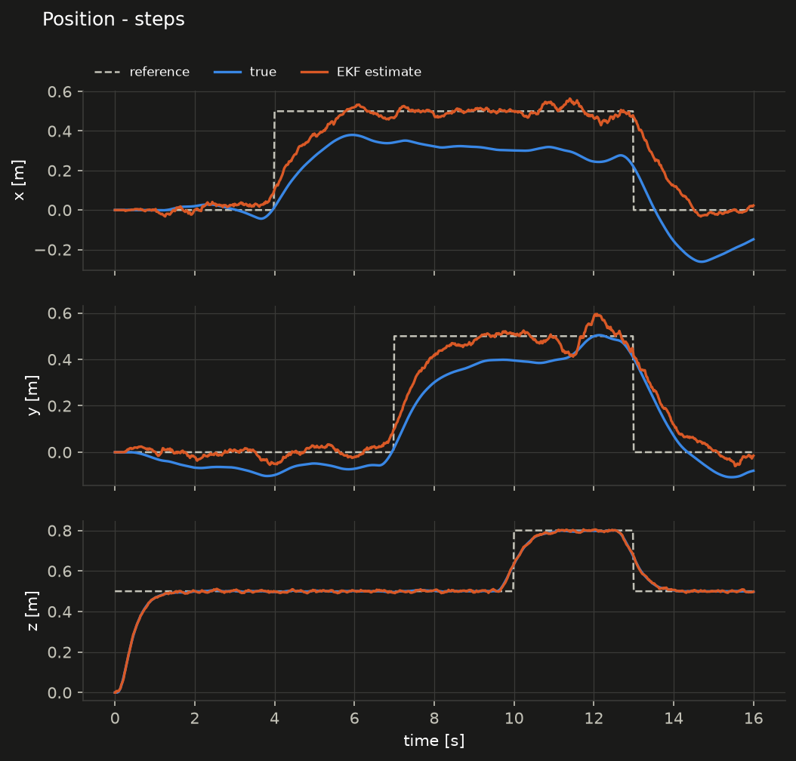

# Crazyflie MPC + EKF (simulation → hardware)

Linear MPC (acados) and a custom EKF for a Crazyflie 2.1 with Flow deck,
ported from a Skydio X2 MATLAB/CasADi design
([Quadcopter-Dynamics-LQR-MPC](https://github.com/dmascheretti/Quadcopter-Dynamics-LQR-MPC)).
The MPC runs offboard in ROS 2 and sends roll, pitch, yaw-rate and thrust
setpoints to the stock onboard attitude controller through Crazyswarm2.

**Status:** complete in simulation, not flown yet.

- C++ simulator: hover, steps, kill switch, geofence and gap-study scenarios.
- Full ROS 2 pipeline: takes off, tracks steps and returns to the start point
  against a simulated Crazyflie.
- 41 C++ tests (gtest) and 9 Python tests.

Next is hardware, following [`docs/hardware_checklist.md`](docs/hardware_checklist.md).

| Document | Content |
|---|---|
| [`docs/design.md`](docs/design.md) | architecture, conventions, model, MPC, EKF, safety, findings |
| [`docs/results_sim.md`](docs/results_sim.md) | simulation metrics, figures, sim-to-real gap study |
| [`docs/hardware_checklist.md`](docs/hardware_checklist.md) | step-by-step plan for the first flights |
| [`docs/identification.md`](docs/identification.md) | how to measure the parameters still marked `assumed` |



## Repository layout

```
model/           params.yaml (ALL physical parameters), Python model, C++ params library
mpc_codegen/     acados OCP (Python) -> generated C solver; mpc_tuning.yaml
ros2_ws/src/
  cf_msgs/       AttitudeCommand message (MPC -> supervisor)
  cf_mpc/        MPC library + mpc_node
  cf_ekf/        EKF library + ekf_node
  cf_bringup/    safety supervisor, kill switch, mission, sim bridge, launch, config
sim/             C++ closed-loop simulator, sim.yaml, scenarios/
analysis/        plots and metrics (plot_sim.py, plot_gap.py), ROS recorder
scripts/         setup and run scripts
docs/            design notes, results, figures
```

The math (model, MPC, EKF, supervisor) has no ROS dependency. The same
source files are compiled into the ROS nodes and into the ROS-free build
at the repo root, which is used for fast tests and the simulator.

## Quick start: simulation without ROS

Ubuntu 24.04:

```bash
./scripts/setup_ubuntu.sh             # Eigen, gtest, yaml-cpp, Python packages, acados
export ACADOS_SOURCE_DIR=$HOME/acados
./scripts/run_sim_all.sh              # codegen, tests, all scenarios, figures
```

Single scenario:

```bash
./build/closed_loop_sim sim/scenarios/steps.yaml sim/output/steps.csv
python3 analysis/plot_sim.py sim/output/steps.csv        # -> docs/figures/
```

## ROS 2 (Jazzy)

Install ROS 2 Jazzy and Crazyswarm2 following the
[Crazyswarm2 installation guide](https://imrclab.github.io/crazyswarm2/installation.html)
(it supports Humble and Jazzy). Then:

```bash
source /opt/ros/jazzy/setup.bash
source ~/crazyswarm2_ws/install/setup.bash        # wherever you built Crazyswarm2
./scripts/build_ros.sh                             # colcon build + test
source ros2_ws/install/setup.bash
```

**Simulation through the full ROS graph** (sim bridge instead of the radio):

```bash
ros2 launch cf_bringup sim.launch.py scenario:=steps
ros2 service call /cf1/safety/arm std_srvs/srv/Trigger    # take-off
```

**Flight.** Read [`docs/hardware_checklist.md`](docs/hardware_checklist.md) first.

```bash
ros2 launch cf_bringup flight.launch.py scenario:=hover          # terminal 1
ros2 run cf_bringup kill_switch_node --ros-args -r __ns:=/cf231   # terminal 2: SPACE = kill
ros2 service call /cf231/ekf/reset std_srvs/srv/Trigger          # drone on the floor
ros2 service call /cf231/safety/arm std_srvs/srv/Trigger         # take-off
```

## Dependencies and why

| Dependency | Why |
|---|---|
| Eigen | linear algebra in all C++ code |
| yaml-cpp | C++ reads `params.yaml` and configs directly, so no parameter is duplicated (already a ROS 2 dependency) |
| GoogleTest | unit tests |
| acados (pinned commit in `scripts/setup_ubuntu.sh`) | MPC code generation + QP solver (HPIPM) |
| numpy, scipy, casadi, pyyaml, matplotlib | code generation, linearisation check, plots |
| ROS 2 Jazzy, Crazyswarm2 | runtime and radio link |

## Development environment used

Ubuntu 24.04 container, GCC 13, CMake 3.28, Python 3.11, acados 6cbbf99
(2026-09-30). ROS 2 Jazzy came from RoboStack (conda), because the ROS apt
repository was not reachable from the container; on a normal machine use
the official apt packages. Crazyswarm2 f1e0995 and crazyflie-firmware
2248ed2 were read to check interfaces and conventions.
