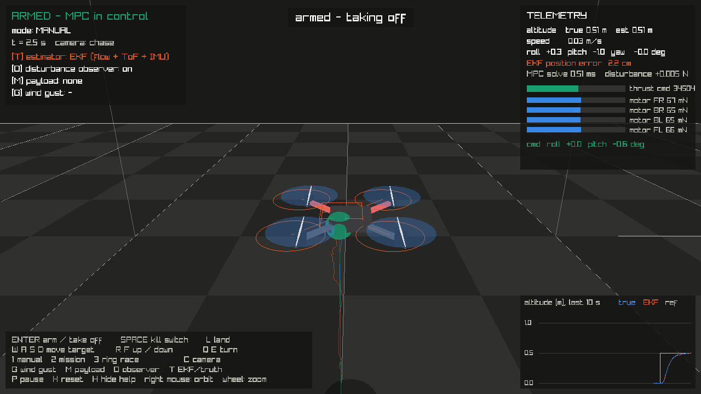
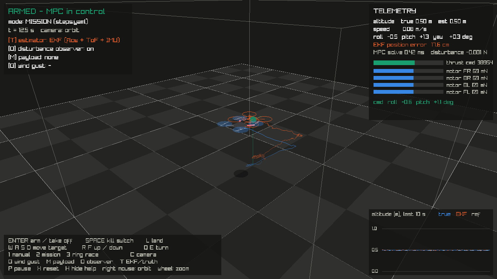
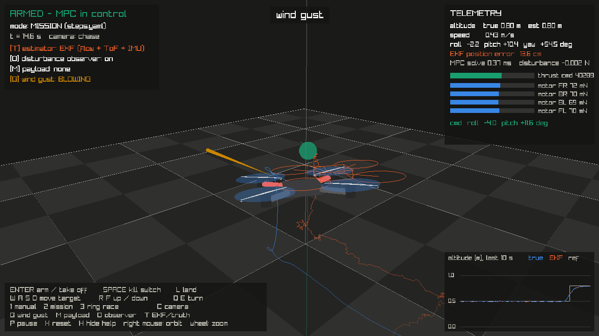
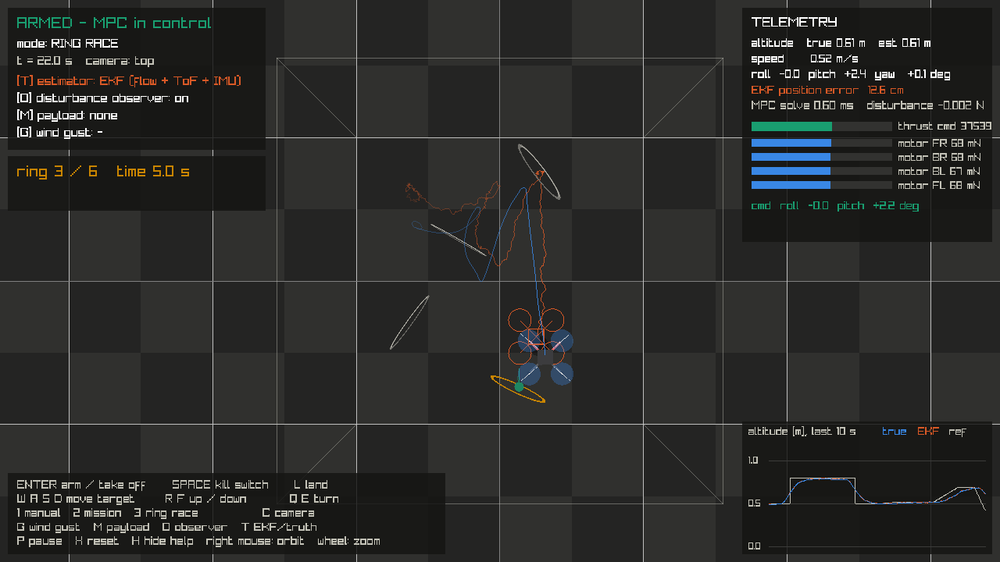
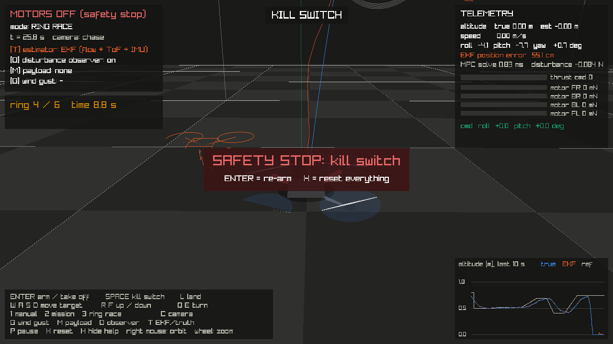

# Software simulation "videogame"

An interactive 3D simulator: you fly the Crazyflie from the keyboard, and
everything is simulated. No drone, radio or ROS needed.

It is a game in how you use it, not in what runs inside. The physics,
sensors, EKF, MPC, safety supervisor and radio delay are the same C++ code
as the batch simulator (`sim::Simulation`, see [`design.md`](design.md)).
Only the drawing and the keyboard are new.



## Start it

```bash
./scripts/run_game.sh
```

The script generates the MPC solver if needed, builds with
`-DCF_BUILD_GAME=ON` and opens a 1280×720 window. It needs a desktop
session and the X11/OpenGL headers listed in the script (also installed by
`scripts/setup_ubuntu.sh`).

**New dependency: raylib 5.5.** It provides the window, 3D drawing and
keyboard. It is small, plain C, and has no dependencies beyond OpenGL/X11.
CMake downloads it at configure time, pinned to tag 5.5, because Ubuntu
does not package it. It is only used when `CF_BUILD_GAME=ON`; the normal
build and the ROS packages do not need it.

## What you control

You never steer the motors. You move the **target** (green ball) and the MPC
flies the drone there, exactly as `mission_node` does on the real drone.
You can also disturb the drone or press the kill switch.

| Key | Action |
|---|---|
| ENTER | arm and take off to 0.5 m (also re-arms after a safety stop) |
| SPACE | kill switch: motors off, latched |
| L | land: target to the floor, motors off on touchdown |
| W A S D | move the target forward / left / back / right (relative to the camera) |
| R / F | target up / down |
| Q / E | turn left / right (yaw) |
| 1 | manual mode |
| 2 | mission mode: flies `sim/scenarios/steps.yaml` |
| 3 | ring race: fly through 6 rings, timed |
| G | wind gust: 0.04 N sideways for 1.5 s (~14 % of the weight) |
| M | payload: drone becomes 15 % heavier than the model |
| O | disturbance observer on/off (offset-free MPC) |
| T | controller uses the EKF estimate or the ground truth |
| C | camera: chase / orbit / top; right mouse drags the orbit, wheel zooms |
| P / X / H | pause / reset everything / hide help |

The target always stays 0.15 m inside the geofence. The drone can still
leave the geofence (gust, drift), and then the supervisor cuts the motors,
as it would in flight.

## What you see

- **Blue solid drone and trail:** the true state. The real drone is 9 cm,
  so it is drawn 3× larger. Propeller discs get brighter with thrust, and
  the front arms are red.
- **Orange wireframe drone and trail:** the EKF estimate, i.e. where the
  controller *thinks* the drone is.
- **Green ball:** the reference given to the MPC; the short line shows the
  reference heading.
- **Box:** the geofence from `safety.yaml`. It turns red when the estimate
  is outside.
- **Status panel:** armed / disarmed / safety stop, mode, and the toggles.
- **Telemetry panel:** true and estimated altitude, attitude, EKF position
  error, MPC solve time, the observer's disturbance estimate, thrust
  command, and the four motor thrusts.
- **Altitude plot:** true, estimated and reference altitude over the last 10 s.

## Things to try (each shows one part of the design)

1. **Flow drift.** Hover for 30 s in orbit view. The orange and blue trails
   separate and the "EKF position error" grows to 10–30 cm, while the
   altitude stays exact. This is flow-only positioning (results_sim.md).
   Press T: with ground truth the drift is gone.
2. **Offset-free MPC.** Press M (payload), then O to turn the observer off:
   the drone sinks about 9–10 cm below the target. Turn O back on: the
   disturbance value converges to about −0.042 N (the missing weight) and
   the drone climbs back to within 1 cm.
3. **Wind gust.** Press G. The drone is pushed, tilts against the gust
   (watch roll/pitch), and comes back. The gust is also felt by the
   simulated accelerometer, so the EKF sees the push.
4. **Safety.** Fly the target to the edge of the box and press G: if the
   estimate leaves the geofence, the motors are cut. Press SPACE in flight
   to try the kill switch. ENTER re-arms from the floor.
5. **Ring race.** Press 3. The rings are checked against the *true*
   position, but you steer using what you see, so the EKF drift makes you
   miss. Good feeling for why absolute positioning matters.

## Screenshots

These come from the scripted demo, which you can re-create with
`./build/cf_sim_game --demo <dir>`.

| | |
|---|---|
|  Mission in orbit view; trails show the EKF drift |  Wind gust (yellow arrow) during the yaw step |
|  Ring race, top view |  Kill switch: motors off, latched |

## How it is built

| File | Content |
|---|---|
| `sim/src/simulation.*` | the complete simulated system, shared with `closed_loop_sim` |
| `sim/game/game.cpp` | main loop, keyboard, modes (manual, mission, race), demo script |
| `sim/game/draw.cpp` | 3D scene and HUD (raylib) |
| `sim/game/game_state.hpp` | what the player controls and what is displayed |

**Timing.** Each frame advances the simulation by the frame time in fixed
1 ms physics steps. Sensors, EKF (500 Hz IMU, 100 Hz flow, 40 Hz ToF), MPC
and supervisor (50 Hz) and the 10 ms radio delay run at their own rates,
exactly as in the batch simulator. On a normal laptop it runs in real
time. Even on a software-rendered virtual display it ran at about 0.9×
real time.

**Reference.** In manual and race mode the MPC gets the target as a
constant over its horizon. In mission mode it gets the scenario waypoints
with preview, as in the batch simulator.

**`--demo <dir>`** runs a fixed script (take-off, mission, orbit camera,
gust, race with an automatic pilot, kill switch), saves the five
screenshots above into `<dir>` and exits. It uses a fixed 1/60 s per
frame, so it is reproducible. It also serves as a smoke test of the whole
game.
