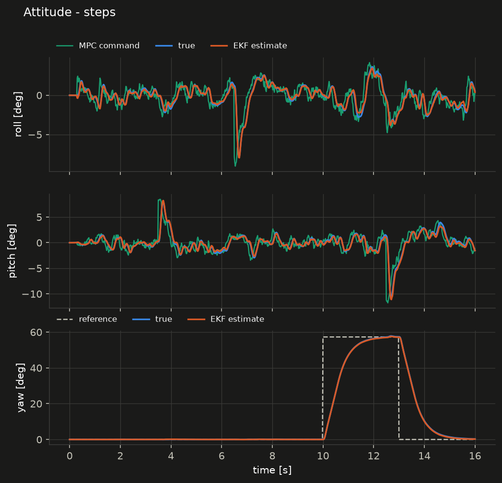
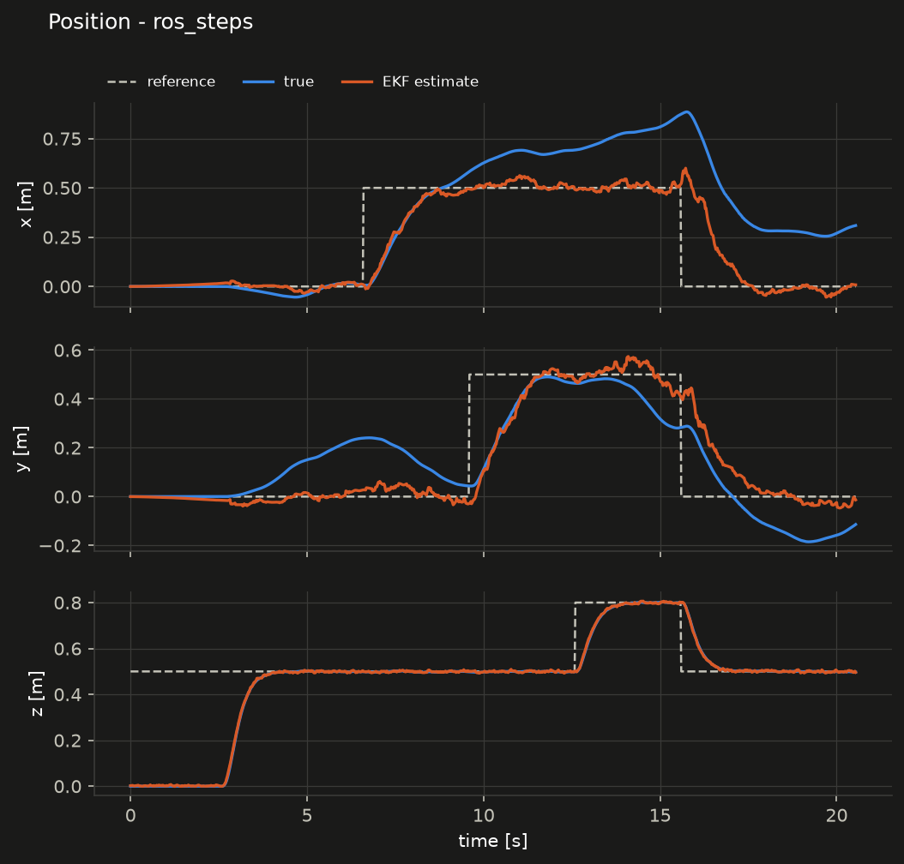
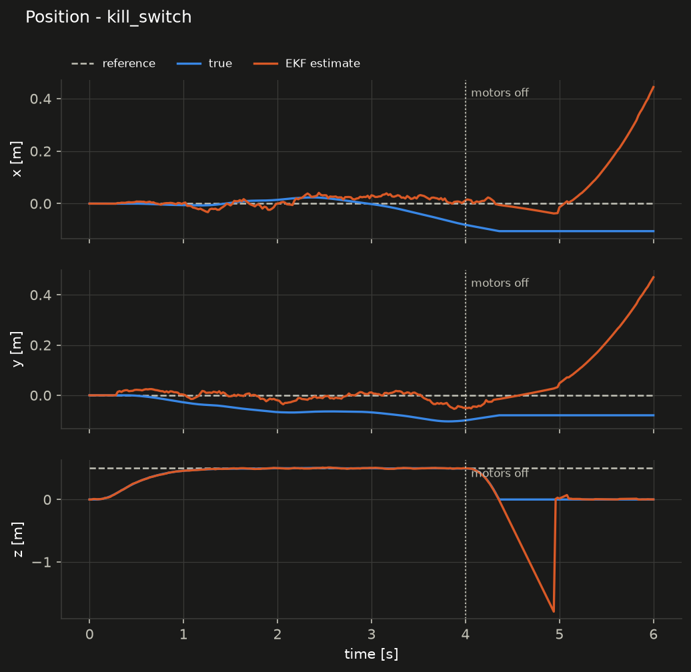
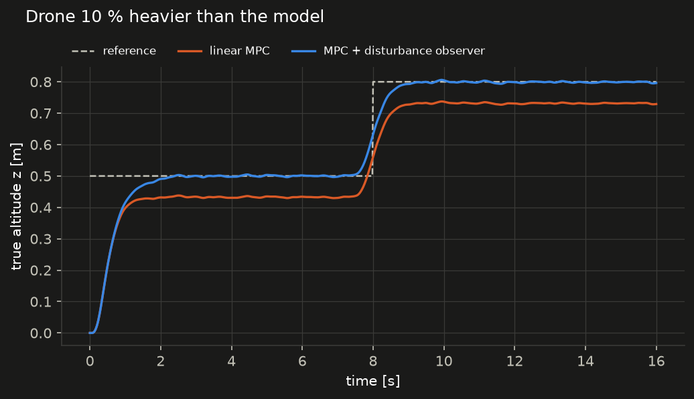

# Simulation results

Reproduce everything with `./scripts/run_sim_all.sh` (C++ simulator) and
the ROS commands at the end of this file. All runs: Crazyflie 2.1 + Flow
deck model from `model/params.yaml`, EKF in the loop (the controller never
sees the true state), 10 ms radio latency, sensor noise from
`sim/config/sim.yaml`, random seed 1.

## Metrics

Taken after take-off (from 2 s after arming) while the motors run.
"track" = true position vs reference, "est" = EKF estimate vs truth.

| Scenario | track xy [m] | track z [m] | est xy [m] | est z [m] | est v [m/s] | est roll/pitch [rad] | tilt RMS [rad] | max solve [ms] | stop [s] |
|---|---|---|---|---|---|---|---|---|---|
| hover | 0.140 | 0.003 | 0.138 | 0.003 | 0.071 | 0.0028 | 0.022 | 0.85 | – |
| steps | 0.240 | 0.032 | 0.202 | 0.003 | 0.077 | 0.0037 | 0.045 | 1.17 | – |
| kill_switch | 0.086 | 0.003 | 0.082 | 0.004 | 0.073 | 0.0024 | 0.019 | 1.88 | 4.00 |
| geofence | 0.797 | 0.014 | 0.072 | 0.004 | 0.061 | 0.0057 | 0.183 | 1.15 | 3.46 |
| ROS pipeline, steps | 0.350 | 0.061 | 0.253 | 0.003 | 0.089 | 0.0048 | 0.046 | 1.87 | – |

The ROS row is a single run of the full ROS graph (sim bridge, EKF node,
MPC node, supervisor, mission) on wall-clock timers, with flow quantised to
integer counts; it is not deterministic.

## What the numbers say

- **Altitude is solid.** ToF makes z absolute: 3 mm estimation RMS, 3 mm
  tracking RMS in hover. The 0.03–0.06 m "track z" of the steps runs is the
  transient of the 0.3 m altitude step, not an offset.
- **Horizontal position drifts, and the controller cannot know.** The
  estimate follows the reference well (the MPC does its job on what it
  sees), but the estimate itself drifts from the truth by 0.1–0.25 m over
  8–16 s. Flow noise alone causes this: with every other noise source off
  the result is the same, and with all noise off the EKF is exact. This is
  the limit of flow-only positioning, not a filter bug. For flight
  experiments that need absolute xy (tracking accuracy), add a Lighthouse
  or mocap reference for evaluation.
- **Tilt jitter** in hover is 0.022 rad (1.3°) RMS, driven by EKF velocity
  noise (~7 cm/s) through the MPC velocity gain.
- **Real-time**: worst MPC solve 1.9 ms in these runs (up to 3.2 ms seen
  in other runs on this shared cloud machine; budget 20 ms).
- **Safety**: kill switch cuts the motors at the commanded time; the
  geofence cuts when the *estimate* leaves the 1 m box (estimate 1.03 m,
  true position 0.975 m at that moment). The geofence acts on the
  estimate, so its margins must include the estimate drift (0.1–0.3 m).

## Figures

Steps scenario, C++ simulator:




Full ROS pipeline, same scenario (mission starts at arming, t ≈ 2.6 s):



Kill switch at t = 4 s (after the cut the estimate is meaningless:
the drone lies on the floor where flow is not used):



All figures are in [`figures/`](figures) as PNG and PDF.

## Sim-to-real gap study (in simulation)

The real drone will not match `params.yaml`. The most direct effect of a
wrong mass or thrust map is a steady altitude offset, because a linear
MPC has no integral action.

| Mismatch | Linear MPC: altitude error | MPC + disturbance observer |
|---|---|---|
| none | +0.001 m | +0.004 m |
| mass +10 % | −0.067 m | +0.003 m |
| thrust −10 % | −0.074 m | +0.003 m |
| mass −10 %, thrust +10 % | – | +0.004 m |

(Mean error during hover; steps scenario 3–10 s for the observer column,
hover scenario for the linear-MPC column.)



The observer is described in [`design.md`](design.md#4-mpc-mpc_codegen-cf_mpc).
Analytic check: a 10 % weight error is 0.028 N; the equivalent LQR thrust
gain is 0.415 N/m, so the expected offset is 0.028 / 0.415 = 6.8 cm, as
measured.

## Reproducing the ROS run

```bash
ros2 launch cf_bringup sim.launch.py scenario:=steps          # terminal 1
python3 analysis/record_ros.py --name cf1 --duration 18 \
        --arm-after 3 sim/output/ros_steps.csv                 # terminal 2
python3 analysis/plot_sim.py sim/output/ros_steps.csv
```
